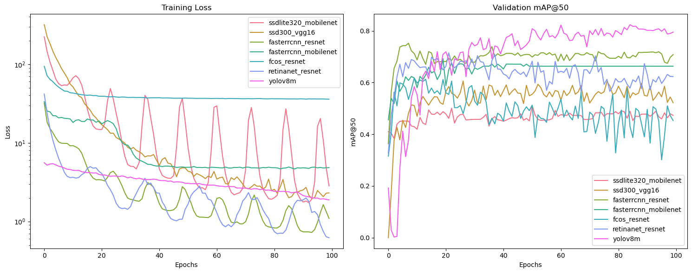
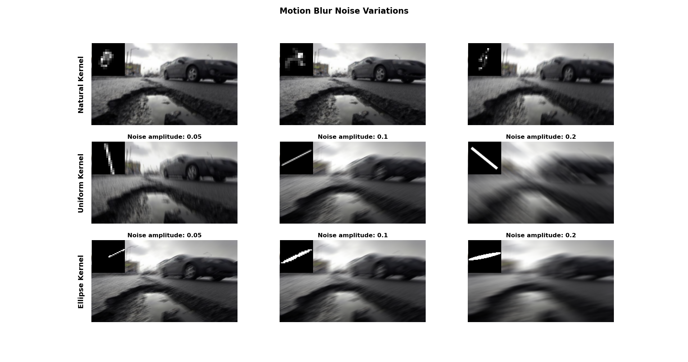

## Model Training

This directory contains the code and scripts used for training the models. The training process involves several steps, including data preprocessing, model selection, hyperparameter tuning, and evaluation. 

### Directory Structure
| File Name                       | Purpose                                                                 |
|---------------------------------|-------------------------------------------------------------------------|
| `data_process.py`               | Handles data preprocessing, such as loading and transforming datasets.  |
| `trainer.py`                    | Manages the training process for torchvision models.                    |
| `evaluator.py`                  | Evaluates the performance of trained models using metrics.              |
| `motion_blur.py`                | Applies our self synthesized motion blur effects to images for testing. |
| `utils.py`                      | Contains utility functions used across different modules.               |
| `torchvision_models_train.ipynb`| Jupyter notebook for training models using torchvision.                 |
| `models_data.json`              | Stores metadata for the models results                                  |
| `models_evaluation_with_noise`   | Directory containing notebooks for training and evaluating models with motion blur noise. |
| `best_new.blob`             | Contains the best model weights for the outdoor model.                    |
| `best_new.onnx`             | Contains the best model weights for the outdoor.                    |

### Dataset
We used the following dataset from kaggle [chitholian_annotated_potholes_dataset](https://www.kaggle.com/datasets/chitholian/annotated-potholes-dataset)

The Dataset contains 665 images of potholes on roads with corresponding annotations boxes for each pothole.

We created a custom torch dataset named PotholeDetectionDataset and then split them to seperate train, validation and test sets (70-10-20).

### Object Detection Models
In this project we trained the following SOTA object detection models:

[torchvision models](https://pytorch.org/vision/stable/models.html#object-detection-instance-segmentation-and-person-keypoint-detection):
- `ssd` [SSD: Single Shot MultiBox Detector](http://dx.doi.org/10.1007/978-3-319-46448-0_2)
- `faster rcnn` [Faster R-CNN: Towards Real-Time Object Detection with Region Proposal Networks](https://arxiv.org/abs/1506.01497)
- `retinanet` [Focal Loss for Dense Object Detection](https://arxiv.org/abs/1708.02002)
- `fcos` [FCOS: Fully Convolutional One-Stage Object Detection](https://arxiv.org/abs/1904.01355)

[ultralytics yolo](https://docs.ultralytics.com/models/yolov8/):
- `yolov8m` [YOLOv8 models documentation](https://docs.ultralytics.com/models/yolov8/)

### Hyperparameter Tuning
In this project, hyperparameter tuning was conducted using Optuna to optimize training on various torchvision models.
A comprehensive search was performed across multiple hyperparameter spaces, including model preweight strategies, optimizer types, learning rates, momentum, and weight decay parameters.
The study involved carefully selecting combinations of hyperparameters to achieve the best validation mean average precision (mAP).
The objective function was optimized using `MedianPruner` and `TPESampler` for better exploration and exploitation across trials. Below is a detailed table of the tuned hyperparameters.

| **Category** | **Hyperparameter** | **Range/Choices**                  | **Description**                          |
|--------------|--------------------|--------------------------------------|--------------------------------------------|
| Model        | `preweight_mode`   | `['random', 'freezing', 'fine_tuning']` | Strategy for loading model weights      |
| Training     | `batch_size`       | `[4, 8]`                            | Number of samples per training batch      |
| Training     | `epochs`           | `[10, 20]`                          | Number of training epochs                 |
| Optimizer    | `optimizer`        | `['SGD', 'Adam', 'AdamW', 'RMSprop']` | Optimization algorithm                   |
| SGD          | `lr`               | `[5e-3, 5e-2]` (log scale)          | Learning rate for SGD                     |
| SGD          | `momentum`         | `[0.9, 0.99]`                       | Momentum for SGD                          |
| SGD          | `weight_decay`     | `[1e-5, 1e-3]` (log scale)          | Weight decay for SGD                      |
| Adam/AdamW   | `lr`               | `[1e-4, 1e-2]` (log scale)          | Learning rate for Adam/AdamW              |
| Adam/AdamW   | `beta1`            | `[0.8, 0.999]`                      | Beta1 parameter                           |
| Adam/AdamW   | `beta2`            | `[0.9, 0.999]`                      | Beta2 parameter                           |
| RMSprop      | `lr`               | `[1e-3, 1e-2]` (log scale)          | Learning rate for RMSprop                 |
| RMSprop      | `momentum`         | `[0.9, 0.99]`                       | Momentum for RMSprop                      |
| RMSprop      | `weight_decay`     | `[1e-1, 1]` (log scale)             | Weight decay for RMSprop                  |
| Scheduler    | `scheduler`        | `['StepLR', 'CosineAnnealingLR', 'ReduceLROnPlateau', 'OneCycleLR']` | Learning rate scheduler type |
| StepLR       | `step_size`        | `[2, 5]`                            | Step size for StepLR                      |
| StepLR       | `gamma`            | `[0.05, 0.5]`                       | Decay factor for StepLR                   |
| CosineAnneal | `T_max`            | `[5, 15]`                           | Maximum cycle length for CosineAnnealingLR|
| CosineAnneal | `eta_min`          | `[1e-7, 1e-5]` (log scale)          | Minimum learning rate                     |
| Plateau      | `factor`           | `[0.1, 0.5]`                        | Decay factor for ReduceLROnPlateau        |
| Plateau      | `patience`         | `[2, 5]`                            | Patience for ReduceLROnPlateau            |
| OneCycleLR   | `max_lr`           | `[1e-4, 1e-2]` (log scale)          | Maximum learning rate for OneCycleLR      |

- The best configurations for each model was saved for future training

## Training Results

  

## Motion Blur Noise

  

