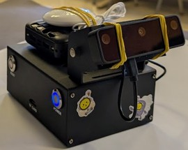
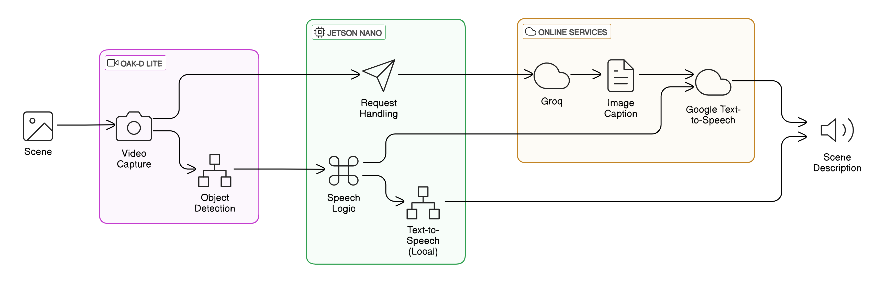
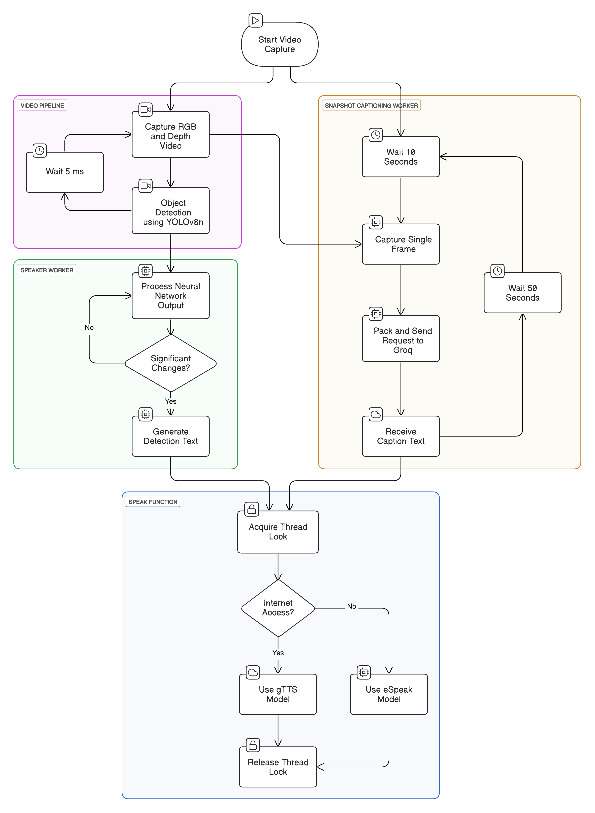
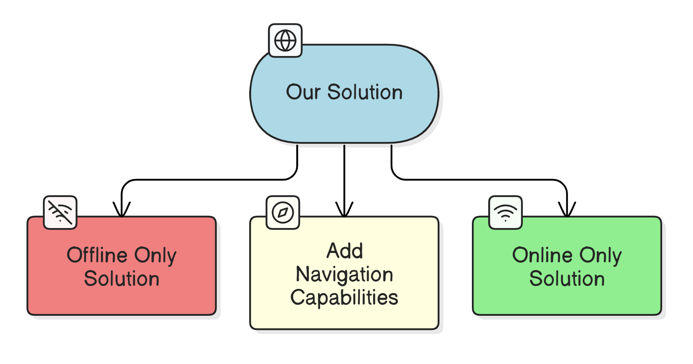

# <h1 align="center">ECE 00440169 - Technion - CRML - Project B </h1> 
<h1 align="center">Blind Guidance System</h1>
<p align="center"><strong>An AI Powered System for the Visually Impaired</strong></p>

<h4 align="center">
  <table align="center" style="border: none;">
    <tr style="border: none;">
      <td align="center" style="border: none;">
        <div>
           <br>
          <strong>Itai Benyamin</strong> <br>
          <a href="https://www.linkedin.com/in/itai-benyamin/">
            
          </a>
          <a href="https://github.com/Itai-b">
            
          </a>
        </div>
      </td>
      <td align="center" style="border: none;">
        <div>
           <br>
          <strong>Idan Baruch</strong> <br>
          <a href="https://www.linkedin.com/in/idan-baruch-76490a181/">
            
          </a>
          <a href="https://github.com/idanbaru">
            
          </a>
        </div>
      </td>
    </tr>
    <tr style="border: none;">
      <td colspan="2" align="center" style="border: none">
        <a href="https://youtu.be/Lghsg8BiNpw" target="_blank">
          
        </a>
      </td>
    </tr>
  </table>
</h4>

## Abstract

<div align="center">
  
</div>

## Table of Contents

## Repository Structure

| File Name                       | Purpose                                                                 |
|---------------------------------|-------------------------------------------------------------------------|
| `01_Setup`               | Instructions and Scripts on how to setup your own system to run the code   |
| `02_Model_Training`                    | Files for training the outdoor Yolov8 model|
| `03_System_Execution`                  | The Code|

each folder contains a README file with more details on the files and their purpose.

## How to Run the Code
After setting up the system (see `01_Setup`), you can run the code by executing the following command in the terminal:
```bash
python3 03_System_Execution/main.py {--mode <mode>} {--record} 
```
where:
- `--help`: if specified, the system will print the help message and exit.
- `--mode <mode>`: the mode of the system. The options are:
  - `outdoor`: for outdoor mode
  - `indoor`: for indoor mode
  if not specified, the system will run in indoor mode.
- `--record`: If specified, the system records camera footage in 30-second .mp4 files, saved under `03_System_Execution/recorded_videos/recorded_videos_<timestamp>`, where `<timestamp>` is the run’s epoch time. Each file is named `video_<timestamp>.mp4`, with a new file created every 30 seconds.

## System's Overview

### System's Components

- **Jetson Nano**:
- **OAK-D Lite Camera**:
- **Battery**: 

### System's Architecture
<div align="center">
  
</div>

## System's Algorithm
<div align="center">
  
</div>

## Challenges

## Future Work
<div align="center">
  
</div>


